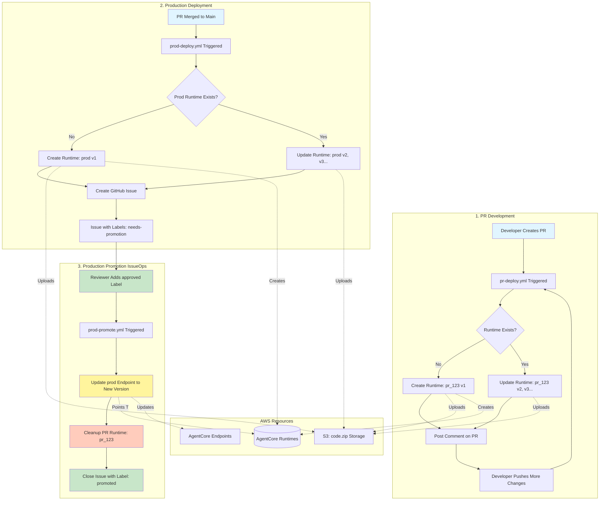
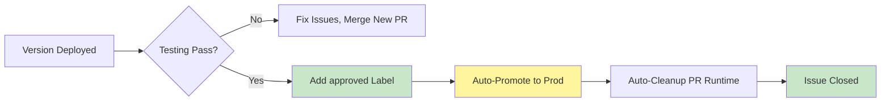

# Building a Production-Ready PR Deployment Workflow for AWS Bedrock AgentCore Runtimes

*A practical guide to implementing GitOps-style deployments with quota-conscious architecture*

---

## 📖 Table of Contents

- [Purpose](#purpose)
- [Understanding AgentCore Runtime Quotas](#understanding-agentcore-runtime-quotas)
- [Workflow Architecture](#workflow-architecture)
- [How It Works](#how-it-works)
- [Getting Started](#getting-started)
- [Script Reference](#script-reference)

---

## Purpose

When building AI agents on AWS Bedrock AgentCore, one of the first challenges teams face is: **How do we safely test changes before deploying to production?**

This repository demonstrates a **complete PR-based deployment workflow** that:

- ✅ **Isolates testing** - Each pull request gets its own dedicated runtime
- ✅ **Enables safe rollbacks** - Production maintains version history
- ✅ **Works within AWS quotas** - Designed around AgentCore's resource limits
- ✅ **Uses IssueOps for approvals** - Simple label-based promotion gates
- ✅ **Automates cleanup** - Prevents runtime accumulation and quota exhaustion

Whether you're building your first agent or scaling to dozens, this pattern helps you ship confidently while staying within AWS service boundaries.

---

## Understanding AgentCore Runtime Quotas

Before diving into the workflow, it's crucial to understand **why** we designed it this way. AWS Bedrock AgentCore has specific quota limits that shape how we architect deployments.

### The Service Limits

| Resource | Soft Quota | Hard Limit |
|----------|------------|------------|
| **Agent Runtimes** | 10 per account/region | Adjustable via support |
| **Versions per Runtime** | 100 | Adjustable via support |
| **Endpoints per Runtime** | 10 | Adjustable via support |

### What This Means for CI/CD

**Naive approach (❌ Don't do this):**
```
PR #1 → Create runtime → Test → Delete runtime
PR #2 → Create runtime → Test → Delete runtime
PR #3 → Create runtime → Test → Delete runtime
...
```

**Problem:** If you have 15 concurrent PRs, you exceed your 10-runtime quota. PRs fail, developers are blocked, and your velocity grinds to a halt.

### AWS's Intended Usage Pattern

The AgentCore team designed the service with this mental model:

1. **Runtimes are long-lived** - Think of them as "applications" or "microservices"
2. **Versions enable iteration** - Each code change creates a new version (up to 100)
3. **Endpoints control traffic** - Point production traffic at stable versions

This is similar to how AWS Lambda aliases work: one function (runtime), many versions, aliases (endpoints) for routing.

### Our Solution

We embrace this model by:

- **PR Runtimes**: One runtime per PR (e.g., `pr_123`), updated with each push
- **Production Runtime**: Single `prod` runtime, accumulating versions over time
- **Automatic cleanup**: PR runtimes deleted after promotion to prod
- **Version-based rollback**: Keep production version history for instant rollbacks

This means with the default 10-runtime quota, you can safely support **9 concurrent PRs** (plus 1 prod runtime).

---

## Workflow Architecture

### Visual Overview



### Three-Stage Pipeline

Our workflow is split into three GitHub Actions workflows, each with a specific responsibility:

#### 🔷 Stage 1: **PR Deploy** (`.github/workflows/pr-deploy.yml`)
- **Triggers:** Pull request opened/updated
- **Runtime Naming:** `pr_{PR_NUMBER}` (e.g., `pr_42`)
- **Behavior:** Creates runtime on first run, updates with new versions on subsequent pushes
- **Output:** Comments on PR with runtime details and test endpoints

#### 🟢 Stage 2: **Production Deploy** (`.github/workflows/prod-deploy.yml`)
- **Triggers:** Code merged to `main` branch
- **Runtime Naming:** Always `prod`
- **Behavior:** Updates prod runtime to create new version (v1, v2, v3...)
- **Output:** Creates GitHub Issue with deployment details and hidden metadata

#### 🟡 Stage 3: **Production Promotion** (`.github/workflows/prod-promote.yml`)
- **Triggers:** `approved` label added to deployment issue (IssueOps pattern)
- **Behavior:** Updates `prod` endpoint to point to new version, cleans up PR runtime
- **Output:** Comments on issue with promotion summary, closes issue

---

## How It Works

### Runtime ID Flow Through Workflows

Understanding how runtime IDs propagate through the system is key to the architecture:

#### 1️⃣ **PR Workflow** → Runtime ID Capture
```yaml
# pr-deploy.yml creates or updates PR runtime
RUNTIME_NAME="pr_${PR_NUMBER}"  # e.g., pr_42

# Extracts runtime ID from deployment output
RUNTIME_ID=$(echo "$OUTPUT" | grep -oP 'Runtime ID: \K[^\s]+')
# Result: pr_42-AbCd1234EfGh5678

# Stores in PR comment with hidden HTML marker
<!-- RUNTIME_ID: pr_42-AbCd1234EfGh5678 -->
```

This hidden comment allows future workflow runs to detect the runtime exists.

#### 2️⃣ **Production Workflow** → Metadata Embedding
```yaml
# prod-deploy.yml retrieves PR runtime ID from PR comments
- Get PR number from merge commit
- Fetch PR comments via GitHub API
- Extract runtime ID from PR comment

# Embeds all metadata in deployment issue
<!-- DEPLOYMENT_METADATA
RUNTIME_ID: prod-XyZ9876WvUt5432
VERSION: 5
PR_RUNTIME_ID: pr_42-AbCd1234EfGh5678
-->
```

This metadata is invisible to users but machine-readable for automation.

#### 3️⃣ **Promotion Workflow** → Automatic Extraction
```javascript
// prod-promote.yml parses issue body when 'approved' label added
const metadataMatch = issueBody.match(/<!-- DEPLOYMENT_METADATA\s+([\s\S]*?)\s+-->/);
const runtimeId = metadata.match(/RUNTIME_ID:\s*(\S+)/)[1];
const version = metadata.match(/VERSION:\s*(\S+)/)[1];
const prRuntimeId = metadata.match(/PR_RUNTIME_ID:\s*(\S+)/)[1];

// No manual input required - everything flows automatically!
```

### S3 Storage Strategy

All code packages are stored in S3 before being deployed to AgentCore. This provides versioning, audit trails, and disaster recovery.

#### Directory Structure
```
s3://agentcore-runtime-pr-deployment-demo/
├── pr_42/              # PR-specific directory
│   ├── v1/
│   │   └── code.zip    # First version of PR
│   ├── v2/
│   │   └── code.zip    # Updated after push
│   └── v3/
│       └── code.zip    # Final version before merge
│
└── prod/               # Production directory
    ├── v1/
    │   └── code.zip    # From first PR merge
    ├── v2/
    │   └── code.zip    # From second PR merge
    ├── v3/
    │   └── code.zip    # From third PR merge
    └── v4/
        └── code.zip    # Current production version
```

**Key Benefits:**
- ✅ **Immutable versions** - Each version's code is preserved
- ✅ **Audit trail** - Can trace what was deployed when
- ✅ **Rollback support** - Can redeploy any previous version
- ✅ **Cost-effective** - S3 storage is cheap for small zip files

**Note:** When PR runtimes are cleaned up, the runtime and endpoints are deleted, but S3 files remain for audit purposes.

### PR Runtime Naming Convention

PR runtimes follow a strict naming pattern: `pr_{PR_NUMBER}`

```python
# Examples from real PRs:
PR #1   → Runtime: pr_1
PR #42  → Runtime: pr_42
PR #123 → Runtime: pr_123
```

**Why this matters:**
1. **Idempotency** - Workflow can detect if runtime already exists
2. **Easy identification** - Clear which runtime belongs to which PR
3. **Automatic cleanup** - Can lookup runtime by PR number for deletion
4. **Collision-free** - PR numbers are unique within a repository

### Production Runtime Version Strategy

The production runtime uses a **single, long-lived runtime** that accumulates versions over time.

#### Version Lifecycle
```
PR #1 merged  → prod runtime v1 created
PR #2 merged  → prod runtime v2 created
PR #3 merged  → prod runtime v3 created
...
PR #99 merged → prod runtime v99 created
```

#### Endpoint Management
```
Initial state:
  prod endpoint → (not created yet)

After first promotion:
  prod endpoint → v1

After second promotion:
  prod endpoint → v2 (v1 still exists!)

After rollback:
  prod endpoint → v1 (instant, no redeployment needed)
```

**Why This Design?**
- ✅ **Instant rollback** - Just update endpoint pointer, no redeployment
- ✅ **Version history** - Can trace every change made to production
- ✅ **A/B testing** - Create multiple endpoints pointing to different versions
- ✅ **Staged rollouts** - Gradually migrate endpoints from v1 → v2
- ✅ **Quota efficiency** - One runtime, 100 versions vs. 100 separate runtimes

### Gated Promotion Process

The promotion to production is **deliberately manual** via the IssueOps pattern. Here's why:

#### The Problem with Auto-Promotion
```
❌ Auto-promote on merge:
- No time for integration testing
- Can't verify in staging first
- No human review gate
- Mistakes go straight to production
```

#### Our Solution: Approval Label
```
✅ IssueOps pattern:
1. Merge creates new version (safe, not live)
2. Review deployment issue (test endpoints, check logs)
3. Add 'approved' label (explicit approval)
4. Automation handles the rest (promotion + cleanup)
```

#### Approval Workflow


**Benefits:**
- 🛡️ **Safety gate** - Prevents bad deploys from reaching production
- 🧪 **Testing window** - Time to verify new version works correctly
- 📊 **Audit trail** - GitHub tracks who approved and when
- 🔄 **Reversible** - Can test version X while prod still serves version X-1
- 👥 **Team visibility** - Everyone sees what's being promoted

---

## Getting Started

Ready to try this workflow in your own AWS account? Here's everything you need to set it up.

### Prerequisites

Before you begin, you'll need:
- AWS Account with Bedrock access
- GitHub repository (or fork of this repo)
- Basic understanding of GitHub Actions
- AWS CLI installed locally (for testing)

### Step 1: Set Up IAM Roles

The workflow requires **two separate IAM roles** with different responsibilities:

#### 🔑 Role 1: GitHub Actions OIDC Role

This role allows GitHub Actions to authenticate to AWS without storing long-term credentials.

**Purpose:** Allows workflows to upload to S3, create/update runtimes, and manage endpoints

**Setup Instructions:**

1. **Create OIDC Identity Provider** in IAM:
   ```
   Provider: token.actions.githubusercontent.com
   Audience: sts.amazonaws.com
   ```

2. **Create IAM Role** with trust policy:
   ```json
   {
     "Version": "2012-10-17",
     "Statement": [
       {
         "Effect": "Allow",
         "Principal": {
           "Federated": "arn:aws:iam::YOUR_ACCOUNT_ID:oidc-provider/token.actions.githubusercontent.com"
         },
         "Action": "sts:AssumeRoleWithWebIdentity",
         "Condition": {
           "StringEquals": {
             "token.actions.githubusercontent.com:aud": "sts.amazonaws.com"
           },
           "StringLike": {
             "token.actions.githubusercontent.com:sub": "repo:YOUR_GITHUB_ORG/YOUR_REPO:*"
           }
         }
       }
     ]
   }
   ```

3. **Attach permissions policy**:
   ```json
   {
     "Version": "2012-10-17",
     "Statement": [
       {
         "Effect": "Allow",
         "Action": [
           "s3:PutObject",
           "s3:GetObject",
           "s3:ListBucket"
         ],
         "Resource": [
           "arn:aws:s3:::YOUR-BUCKET-NAME/*",
           "arn:aws:s3:::YOUR-BUCKET-NAME"
         ]
       },
       {
         "Effect": "Allow",
         "Action": [
           "bedrock-agentcore-control:CreateAgentRuntime",
           "bedrock-agentcore-control:UpdateAgentRuntime",
           "bedrock-agentcore-control:GetAgentRuntime",
           "bedrock-agentcore-control:DeleteAgentRuntime",
           "bedrock-agentcore-control:ListAgentRuntimes",
           "bedrock-agentcore-control:CreateAgentRuntimeEndpoint",
           "bedrock-agentcore-control:UpdateAgentRuntimeEndpoint",
           "bedrock-agentcore-control:GetAgentRuntimeEndpoint",
           "bedrock-agentcore-control:DeleteAgentRuntimeEndpoint",
           "bedrock-agentcore-control:ListAgentRuntimeEndpoints"
         ],
         "Resource": "*"
       },
       {
         "Effect": "Allow",
         "Action": "iam:PassRole",
         "Resource": "arn:aws:iam::YOUR_ACCOUNT_ID:role/AgentCoreExecutionRole"
       }
     ]
   }
   ```

4. **Note the Role ARN** - You'll need this for the workflows:
   ```
   arn:aws:iam::YOUR_ACCOUNT_ID:role/GitHub-Actions-Role
   ```

#### 🤖 Role 2: AgentCore Execution Role

This role is assumed by the AgentCore runtime when executing your agent code.

**Purpose:** Allows your agent to call Bedrock models, access DynamoDB, etc.

**Setup Instructions:**

1. **Create IAM Role** with trust policy:
   ```json
   {
     "Version": "2012-10-17",
     "Statement": [
       {
         "Effect": "Allow",
         "Principal": {
           "Service": "bedrock.amazonaws.com"
         },
         "Action": "sts:AssumeRole"
       }
     ]
   }
   ```

2. **Attach permissions policy** (customize based on your agent's needs):
   ```json
   {
     "Version": "2012-10-17",
     "Statement": [
       {
         "Effect": "Allow",
         "Action": [
           "bedrock:InvokeModel",
           "bedrock:InvokeModelWithResponseStream"
         ],
         "Resource": "arn:aws:bedrock:*::foundation-model/*"
       }
     ]
   }
   ```

3. **Note the Role ARN**:
   ```
   arn:aws:iam::YOUR_ACCOUNT_ID:role/AgentCoreExecutionRole
   ```

### Step 2: Update Code with Your ARNs

After creating both roles, update the following files:

#### Update Workflow Files (3 locations)

**File:** `.github/workflows/pr-deploy.yml` (line 44)
```yaml
- name: Configure AWS credentials
  uses: aws-actions/configure-aws-credentials@v4
  with:
    role-to-assume: arn:aws:iam::YOUR_ACCOUNT_ID:role/GitHub-Actions-Role
    aws-region: us-west-2
```

**File:** `.github/workflows/prod-deploy.yml` (line 44)
```yaml
- name: Configure AWS credentials
  uses: aws-actions/configure-aws-credentials@v4
  with:
    role-to-assume: arn:aws:iam::YOUR_ACCOUNT_ID:role/GitHub-Actions-Role
    aws-region: us-west-2
```

**File:** `.github/workflows/prod-promote.yml` (line 57)
```yaml
- name: Configure AWS credentials
  uses: aws-actions/configure-aws-credentials@v4
  with:
    role-to-assume: arn:aws:iam::YOUR_ACCOUNT_ID:role/GitHub-Actions-Role
    aws-region: us-west-2
```

#### Update Deployment Scripts (2 locations)

**File:** `deploy_runtime_with_deps.py` (line 12)
```python
ROLE_ARN = 'arn:aws:iam::YOUR_ACCOUNT_ID:role/AgentCoreExecutionRole'
```

**File:** `update_runtime_with_deps.py` (line 11)
```python
ROLE_ARN = 'arn:aws:iam::YOUR_ACCOUNT_ID:role/AgentCoreExecutionRole'
```

#### Update S3 Bucket Name (throughout codebase)

Search and replace `agentcore-runtime-pr-deployment-demo` with your S3 bucket name in:
- `deployment_utils.py`
- `.github/workflows/pr-deploy.yml`
- `.github/workflows/prod-deploy.yml`
- `.github/workflows/prod-promote.yml`

### Step 3: Try the Workflow

Now let's walk through the complete flow!

#### 🧪 Test 1: Create a PR Deployment

1. **Create a feature branch:**
   ```bash
   git checkout -b test-deployment
   ```

2. **Make a small change** (e.g., edit `prompts/dad_joke_bot.txt`):
   ```bash
   echo "You are a hilarious dad joke bot!" > prompts/dad_joke_bot.txt
   git add prompts/dad_joke_bot.txt
   git commit -m "Update dad joke bot prompt"
   git push origin test-deployment
   ```

3. **Create pull request** on GitHub

4. **Watch the workflow run:**
   - Go to Actions tab → "PR Runtime Deployment"
   - Should see workflow running
   - Wait for completion (~2-3 minutes)

5. **Check PR comment:**
   - Your PR should have a comment with runtime details
   - Note the Runtime ID (e.g., `pr_1-AbCd1234...`)
   - You can test using the DEFAULT endpoint listed

6. **Make another change and push:**
   ```bash
   echo "You are an AMAZING dad joke bot!" > prompts/dad_joke_bot.txt
   git add prompts/dad_joke_bot.txt
   git commit -m "Make bot more enthusiastic"
   git push origin test-deployment
   ```

7. **Watch comment update:**
   - PR comment updates with new version (v2)
   - Same runtime, new version!

#### 🚀 Test 2: Deploy to Production

1. **Merge your PR** to main branch

2. **Watch production deployment:**
   - Go to Actions tab → "Production Deployment"
   - Workflow runs automatically
   - Creates/updates `prod` runtime

3. **Check GitHub Issues:**
   - New issue created: "🚀 Production Deployment Ready - Version X"
   - Issue has labels: `deployment`, `production`, `needs-promotion`
   - Contains all metadata about the deployment

4. **Review deployment issue:**
   - Check Runtime ID
   - Check version number
   - Note PR runtime ID for cleanup

#### ✅ Test 3: Promote to Production (IssueOps)

1. **Test the new version** (optional but recommended):
   - Use AWS Console or CLI to test DEFAULT endpoint
   - Verify agent works as expected

2. **Add approval label:**
   - Go to the deployment issue
   - Add label: `approved`
   - That's it!

3. **Watch promotion workflow:**
   - Go to Actions tab → "Production Promotion"
   - Workflow triggers automatically
   - Updates prod endpoint
   - Cleans up PR runtime
   - Closes issue

4. **Verify completion:**
   - Issue should be closed with `promoted` label
   - Comment shows promotion summary
   - PR runtime is deleted (check Actions logs)

#### 🔄 Test 4: Rollback (Optional)

If you need to rollback to a previous version:

1. **Trigger manual promotion:**
   ```bash
   gh workflow run prod-promote.yml \
     -f prod_runtime_version=1 \
     -f issue_number=2
   ```

2. **Or create a rollback issue manually:**
   - Copy metadata format from a previous deployment issue
   - Change VERSION to desired version
   - Add labels: `deployment`, `production`, `needs-promotion`
   - Add label: `approved`

---

## Script Reference

The repository includes standalone Python scripts for manual runtime management. These are useful for local testing or one-off operations.

### Prerequisites

- AWS credentials configured
- Python 3.9+
- `uv` package manager installed
- Required Python packages: `boto3`

### 1. Deploy Runtime

Deploy a new AgentCore Runtime with ARM64 dependencies.

**Script:** `deploy_runtime_with_deps.py`

**Usage:**
```bash
# Deploy with default prompt
python3 deploy_runtime_with_deps.py

# Deploy with a specific prompt file
python3 deploy_runtime_with_deps.py --prompt <path_to_prompt_file>
```

**Examples:**
```bash
# Deploy with dad joke bot personality
python3 deploy_runtime_with_deps.py --prompt prompts/dad_joke_bot.txt

# Deploy with motivational quotes bot personality
python3 deploy_runtime_with_deps.py --prompt prompts/motivational_quotes_bot.txt
```

**Output:**
- Creates a new runtime with a unique ID
- Returns Runtime ID, Runtime ARN, and Version number

---

### 2. Update Runtime

Update an existing AgentCore Runtime with new code or a different prompt.

**Script:** `update_runtime_with_deps.py`

**Usage:**
```bash
# Update runtime (keeps existing prompt)
python3 update_runtime_with_deps.py <runtime_id>

# Update runtime with a new prompt
python3 update_runtime_with_deps.py <runtime_id> --prompt <path_to_prompt_file>
```

**Examples:**
```bash
# Update runtime keeping current configuration
python3 update_runtime_with_deps.py test_runtime_with_deps_1234567890-AbCdEfGhIj

# Update runtime with dad joke bot personality
python3 update_runtime_with_deps.py test_runtime_with_deps_1234567890-AbCdEfGhIj --prompt prompts/dad_joke_bot.txt

# Update runtime with motivational quotes bot personality
python3 update_runtime_with_deps.py test_runtime_with_deps_1234567890-AbCdEfGhIj --prompt prompts/motivational_quotes_bot.txt
```

**Output:**
- Creates a new version of the runtime
- Returns Runtime ARN and new Version number

---

### 3. Create Endpoint

Create an endpoint (alias) that points to a specific runtime version.

**Script:** `create_endpoint.py`

**Usage:**
```bash
# Create endpoint with auto-generated name
python3 create_endpoint.py <runtime_id> <version>

# Create endpoint with custom name
python3 create_endpoint.py <runtime_id> <version> <endpoint_name>
```

**Examples:**
```bash
# Create endpoint with auto-generated name pointing to version 1
python3 create_endpoint.py test_runtime_with_deps_1234567890-AbCdEfGhIj 1

# Create production endpoint pointing to version 1
python3 create_endpoint.py test_runtime_with_deps_1234567890-AbCdEfGhIj 1 prod_deployment

# Create staging endpoint pointing to version 2
python3 create_endpoint.py test_runtime_with_deps_1234567890-AbCdEfGhIj 2 staging_deployment
```

**Output:**
- Endpoint Name
- Endpoint ARN
- Confirms version it points to

---

### 4. Update Endpoint

Update an existing endpoint to point to a different runtime version.

**Script:** `update_endpoint.py`

**Usage:**
```bash
python3 update_endpoint.py <runtime_id> <endpoint_name> <new_version>
```

**Examples:**
```bash
# Update prod_deployment endpoint to point to version 2
python3 update_endpoint.py test_runtime_with_deps_1234567890-AbCdEfGhIj prod_deployment 2

# Update staging_deployment endpoint to point to version 3
python3 update_endpoint.py test_runtime_with_deps_1234567890-AbCdEfGhIj staging_deployment 3
```

**Output:**
- Shows current endpoint status and version
- Confirms update to new version
- Returns Endpoint ARN

---

### 5. Clean Up Runtime

Delete all custom endpoints and the runtime itself. This is a destructive operation that requires confirmation.

**Script:** `cleanup_runtime.py`

**Usage:**
```bash
python3 cleanup_runtime.py <runtime_id>
```

**Examples:**
```bash
# Clean up a runtime (will prompt for confirmation)
python3 cleanup_runtime.py test_runtime_with_deps_1234567890-AbCdEfGhIj
```

**What it does:**
1. Lists all endpoints for the runtime
2. Deletes all custom endpoints (keeps 'default' endpoint if present)
3. Verifies each endpoint deletion
4. Deletes the runtime itself
5. Waits for and verifies runtime deletion

**Output:**
- Lists all endpoints found
- Shows deletion progress for each endpoint
- Verifies endpoint deletions
- Confirms runtime deletion with status updates
- ⚠️ Requires typing 'DELETE' to confirm the operation

**Safety Features:**
- Interactive confirmation required (type 'DELETE')
- Preserves 'default' endpoint (if it exists)
- Verifies each deletion before proceeding
- Detailed status reporting
- Error handling with clear messages

---

## Complete Workflow Example

Here's a typical deployment workflow:

```bash
# 1. Deploy a new runtime with dad joke bot
python3 deploy_runtime_with_deps.py --prompt prompts/dad_joke_bot.txt
# Output: Runtime ID: test_runtime_with_deps_1234567890-AbCdEfGhIj, Version: 1

# 2. Create a production endpoint pointing to version 1
python3 create_endpoint.py test_runtime_with_deps_1234567890-AbCdEfGhIj 1 prod_deployment
# Output: Endpoint prod_deployment created, pointing to version 1

# 3. Update the runtime with a new personality
python3 update_runtime_with_deps.py test_runtime_with_deps_1234567890-AbCdEfGhIj --prompt prompts/motivational_quotes_bot.txt
# Output: New Version: 2

# 4. Update the production endpoint to use the new version
python3 update_endpoint.py test_runtime_with_deps_1234567890-AbCdEfGhIj prod_deployment 2
# Output: prod_deployment now points to version 2

# 5. When done, clean up the runtime and all endpoints
python3 cleanup_runtime.py test_runtime_with_deps_1234567890-AbCdEfGhIj
# Output: Deletes all custom endpoints, then deletes the runtime
```

---

## Available Prompts

The repository includes pre-configured prompts in the `prompts/` directory:

- **`dad_joke_bot.txt`** - Responds with dad jokes to everything
- **`motivational_quotes_bot.txt`** - Provides motivational quotes and encouragement

You can create your own prompt files following the same format.

---

## Agent Structure

The agent code is located in `agent/agent.py` and automatically reads the system prompt from a `system_prompt.txt` file if included in the deployment package.

**Requirements:**
- `agent/requirements.txt` - Python dependencies
  - `strands-agents` - Agent framework
  - `bedrock-agentcore` - AgentCore SDK

---

## Deployment Package Process

The deployment process (handled by `deployment_utils.py`):

1. Installs ARM64-compatible Python dependencies using `uv`
2. Sets proper POSIX permissions (644 for files, 755 for directories)
3. Creates a zip package using native `zip` command (preserves permissions)
4. Adds `agent.py` and optional `system_prompt.txt` to the zip root
5. Uploads to S3
6. Creates/updates the runtime via AWS API

---

## Troubleshooting

### Runtime initialization timeout
- Ensure your agent code doesn't perform heavy operations during import
- Use lazy initialization for expensive resources
- Check CloudWatch logs for detailed error messages

### Permission errors
- The deployment scripts handle permissions automatically
- If issues persist, verify your IAM role has proper S3 and AgentCore permissions

### Package size limits
- Maximum 250 MB (zipped), 750 MB (unzipped)
- The script will warn you if the package exceeds limits

---

## Additional Resources

- See `learnings-build-process.md` for detailed explanation of the build process
- Check AWS documentation for AgentCore Runtime API details
